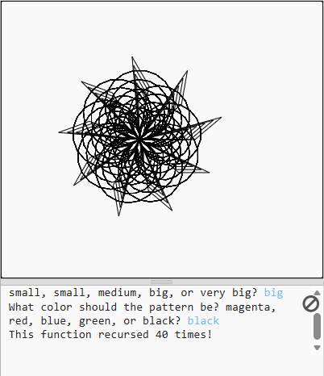
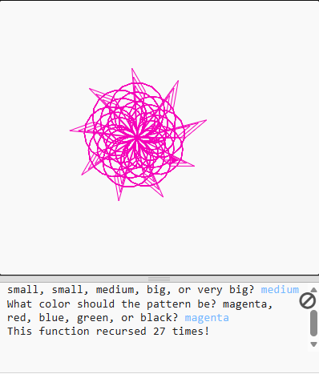

PROGRAM FUNCTION:
My program uses user input to draw a pattern from the middle of the screen(0,0). The user will be asked for a size(very small, small, medium, big, very big), and the output will be
assigned to a number, which is the size of the pattern. It will do the same with a color, assigning the list to a hex code and substituting the color. When the pattern is done, it
with display how many times the function has recursed by tracking a variable called count at the top of the function, so whenever the function is recursed the count will add 1 to itself.

METHOD I USED:
I first initilazed the variables i would need: the size and color of the function, and the count of the recursions. Then I defined the function, and added the Turtle code tha simply draws
a circle then a scalene triangle, and moving back to the start position. I then added code that decreases the size of the shape by 0.75 every recursion, which would work towards a base case
which is coming up. I then increases the count by one, which would count the amount of recursions there would be. Lastly, i added a base case, which says that when the size reaches 0 (after
decreasing by 0.75 every recursion), it will print the amount recursions and return 0, exiting the loop. Outside of the base case but inside the function, i called the function so it would
repeat itself until the base case is met. The last thing i did was call the function outside of the function to kick off the first recursion after all the input from the user was collected.

TESTING + DOCUMENTATION:
I tested the size of the shape by running the code 5 times to see if the pattern got bigger every increase of the desired size. I did the same with the color, testing all 5 of the avilable
colors to see if they visually changed. I tested the number of recursions my setting size to a constant divisible by 10, and doing easy math to check if the function worked. Since the size
decreased by 0.75, there should be 1.25 more recurions than the size. I tested the size to be 30 and got 40, so i know it is right. 

I tested all of the colors and shapes by choosing all of them once and running the code to see if it worked, here is an example of a medium shape with a magenta color.

CHALLENGES:
Some challenges i experienced were the text telling you how many recursions there were displaying only 0, and i realized that
that was because whenever the function recursed, the variable reset to zero. I tryed putting the variable outside of the function, but then it didnt recognize it as it wasnt a local variable anymore. Finally, i made it a parameter of the function,
defining the variable and also not reseting it when the function recurses. Another major challenged i faced was implementing the color. I originally couldnt figure out how to implement color in Turtle code, until i reviewed the notes. I then had trouble with using the dict i made for the color and the input from the user to change the color when the user says so. I managed to figure it out and fit them all in one line.

PEER REVIEW(MASON):
    I like that Marko's code is not super long. This makes it less complicated and easier to read. However it may seem too simple in situations as he could have improved on adding extra features in order to create diversity in his drawing. His turtle code is good and produces a neat shape, comprised of blade-like prongs and circles. I feel like there could have been more diversity for the customization, such as custom sizes rather than presets. This is also good in a sense because it prevents the user from overloading the system by creating a huge shape. This is also control as it prevents the user from inputting an incorrect term, however this could be expanded upon by using while loops to further check whether the user has inputted a valid term or not. In the end, I think that Marko's code is well built and produces a nice shape with good results.
